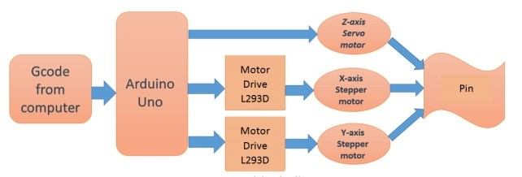

# Mini CNC Pen Plotter

## Overview

Designed and implemented a compact CNC (Computer Numerical Control) plotter using Arduino Nano, stepper motors, and the GRBL (G-code Real-time Boot Loader) library. Integrated GRBL library for interpreting G-code instructions, enabling precise control of stepper motors, allowing users to easily convert digital designs into physical drawings.

- **Tech Stack:** GRBL firmware, Inkscape (G-code generation)
- **Hardware:** Arduino Nano (C/C++), Stepper Motors
  

## Block Diagram:

## Demo

[Watch Demo on YouTube](https://www.youtube.com/watch?v=nTrbES8yj90)

## Circuit Diagram

## Additional Resources

- [Report](Report.pdf)
- [GRBL Library GitHub](https://github.com/TGit-Tech/GRBL-28byj-48)
- [Universal G-Code Sender (UGS)](https://winder.github.io/ugs_website/download/)
- [Inkscape Installer (.exe)](https://inkscape.org/release/1.0.2/windows/)
- [JSCUT](https://jscut.org/)
